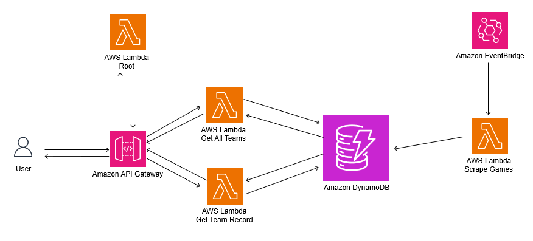

# AWSNBAWebScraper

Create and run your own Serverless NBA game web scraper on AWS. Below is the infrastructure used for the solution:

Every morning, an EventBridge trigger will cause a Lambda function to trigger. This lambda function will scrape the previous days NBA games and will update the teams records that are stored in DynamoDB. 

Separately, whenever the user hits one of the three endpoints made available by the API Gateway, the API Gateway will route the user to the correct Lambda function to get the correct response. 

Routes Include:
  1. Root('/') -> Will return a list of all available endpoints provided by the API
  2. Get All Teams('/allTeams') -> Query the database, get a list of all teams in the database, return list of all teams to the user
  3. Get Team Record('/record?team={teamName}') -> Query the database for the provided teams record, return the record to the user
